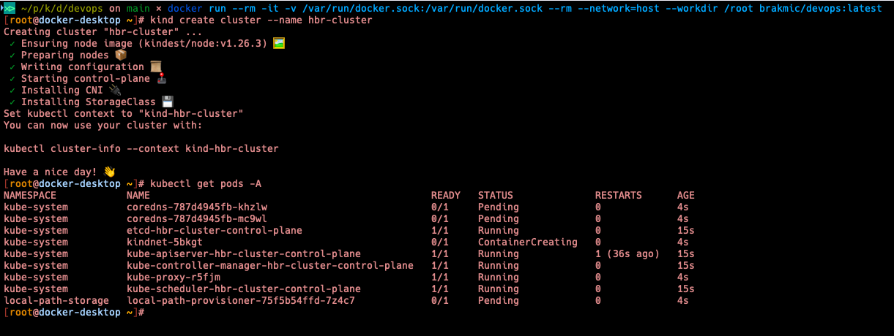
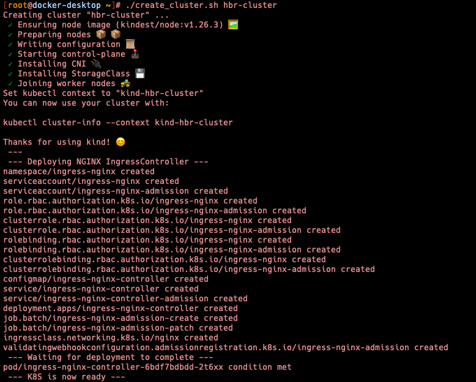

## miniDevOps - A DevOps Toolkit Operated within Docker (Alpine Linux)

The toolkit encompasses the following DevOps tools:

* kubectl (alias: `kubecolor`)
* helm
* terraform
* kind
* docker-compose
* krew (serving as kubectl's plugin manager)
* kubens
* kubectx
* [stern](howtos/stern.md)
* [skaffold](howtos/skaffold.md)
* [kubeseal](howtos/kubeseal.md)
* kubelogin
* [lazydocker](https://github.com/jesseduffield/lazydocker)

In addition, it comprises the subsequent packages:

* bash (with completion functionality)
* nano (featuring syntax highlighting)
* vim
* git
* gcc
* go
* python3
* make
* zip
* lynx
* curl
* wget
* jq
* ncurses
* apache2-ssl, accompanied by apache2-utils


## Setup

The [config.yml](./config.yml) file houses a suggested Kind cluster configuration. Don't hesitate to adjust it to fit your specific needs.

To execute the image, use the following command:

```bash
$ docker run --rm -it -v /var/run/docker.sock:/var/run/docker.sock --network=host --workdir /root brakmic/devops:latest
```

The `/var/run/docker.sock` volume binding provides a pathway for communication with the host's Docker instance.

From within the container's shell, you can establish a new cluster with this command: `kind cluster create --name hbr-cluster`.


[](https://github.com/brakmic/miniDevOps/blob/dc198a8a54af670753833408d7263432a31a40cf/images/minidevops.png)

You're now able to establish a new cluster and subsequently clone the updated `.kube/config` into `/root/local`. The content of this location will remain available, even after a Docker shutdown.

Additionally, a shell script titled `create_cluster.sh` is available. This script not only sets up the cluster but also deploys the NGINX IngressController.

You can execute it as follows: `./create_cluster.sh hbr-cluster`

[](https://github.com/brakmic/miniDevOps/blob/dc198a8a54af670753833408d7263432a31a40cf/images/setup_cluster.png)

## Maintaining persistent Kubernetes Clusters across Docker sessions

If you'd like to retain the cluster that you've created during a session, you can do so by simply duplicating the current .kube/config to a local volume. The next time you launch miniDevOps, all you need to do is replace the default .kube/config with the one you've saved. Here's an illustrative example:


```bash
docker run --rm -it -v /var/run/docker.sock:/var/run/docker.sock -v ${PWD}:/root/local --rm --network=host --workdir /root brakmic/devops:latest
```

You now have the ability to create a new cluster and subsequently duplicate the refreshed `.kube/config` to `/root/local`. This location will retain its content, even after the Docker system is shut down.

The Docker image is available at: https://hub.docker.com/r/brakmic/devops

# LICENSE
[MIT](LICENSE.md)

